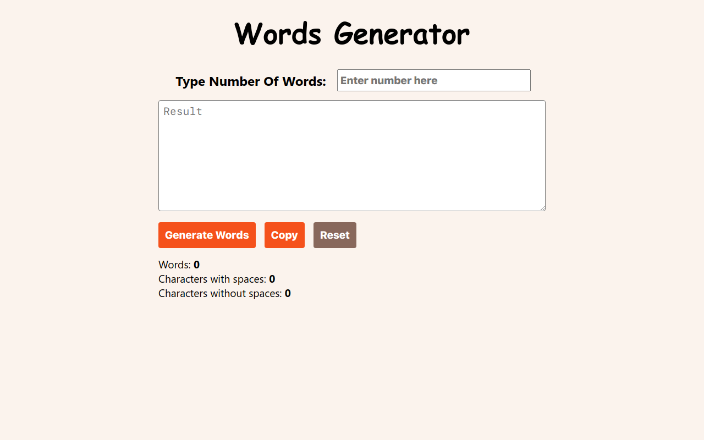

# Words Generator Web App

## Overview

Welcome to the Words Generator Web App project! This app allows users to generate a specified number of random words. It displays the number of generated words, character count with and without spacing, and provides a copy button for easy use. Additionally, a reset button is included to clear the input and generated words. Built with HTML, CSS, and JavaScript, this project showcases the power of DOM manipulation.

### Table of Contents

- [Installation](#installation)
- [How to use](#how-to-use)
- [Technologies Used](#technologies-used)
- [Features](#features)
- [Project Structure](#project-structure)
- [Credits](#credits)
- [License](#license)



## Installation

To run this project locally, follow these steps:

1. Clone the repository to your local machine.
    ```bash
    git clone https://github.com/m-ramzan786/Words-Generator.git
    ```

2. Open the project folder in your code editor.

3. Open the `index.html` file in your web browser.

## How to Use

To use the Words Generator Web App:

1. Open the [live demo](https://words-generator-ochre.vercel.app/) or run it locally.

2. Enter the desired number of words in the input field.

3. Click the "Generate" button to generate random words.

4. View the number of generated words and character counts.

5. Use the "Copy" button to copy the generated words.

6. Use the "Reset" button to clear the input and generated words.

## Technologies Used

- HTML
- CSS
- JavaScript (DOM manipulation and local storage)

## Features

- **Random Words Generation:** Enter the number of words and generate random words.

- **Character Count:** Display character count with and without spacing.

- **Copy Button:** Copy the generated words for convenient use.

- **Reset Button:** Clear the input and generated words.

- **User-Friendly Interface:** Simple design for ease of use.

- **Responsive:** Responsive design for various screen sizes.

## Project Structure

The project is structured for easy navigation, featuring a clean and responsive design.

## Credits

- [Muhammad Ramzan](https://github.com/m-ramzan786) - Project Creator

## License

This project is licensed under the [MIT License](LICENSE). Feel free to use and modify the code as per the license terms.

## Badges


## How to Contribute

If you'd like to contribute to the project, follow these steps:

1. Fork the project.
2. Create a new branch for your feature: `git checkout -b feature-name`.
3. Commit your changes: `git commit -m 'Add new feature'`.
4. Push to the branch: `git push origin feature-name`.
5. Open a pull request.

## Contact

If you have any questions, suggestions, or just want to connect, feel free to reach out:

- Email: [mramzanstv@gmail.com](mramzanstv@gmail.com)
- Portfolio: [Muhammad-Ramzan-Portfolio](https://muhammad-ramzan.vercel.app/)
- LinkedIn: [in/m-ramzan786](https://www.linkedin.com/in/m-ramzan786/)

## Tests

The project includes a set of tests to ensure the functionality is working as expected. To run the tests, use the following command:
```bash
npm test
```

Happy word generating!
